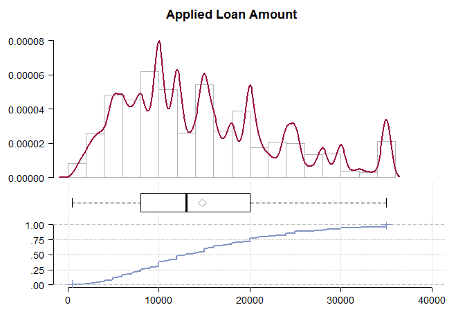
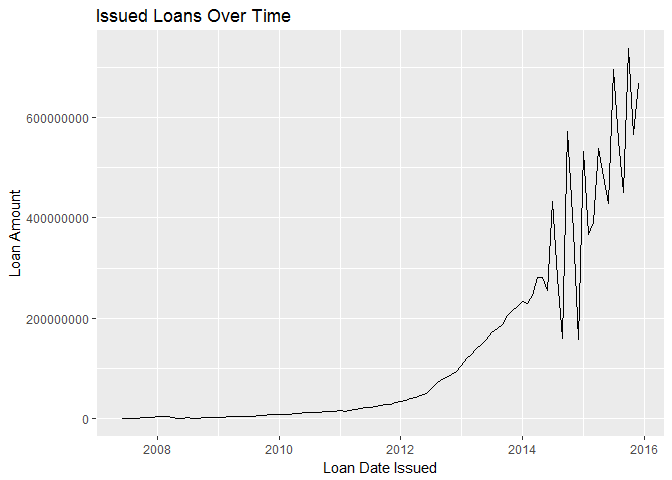
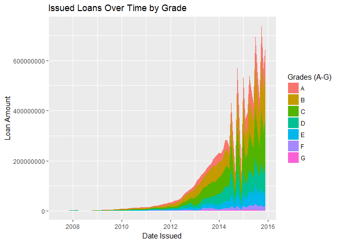
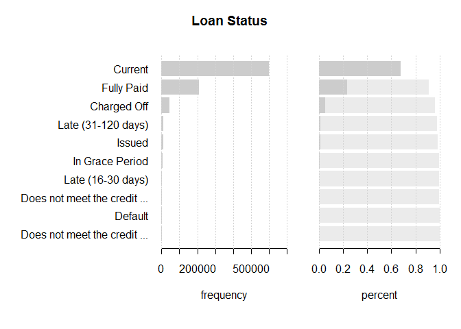
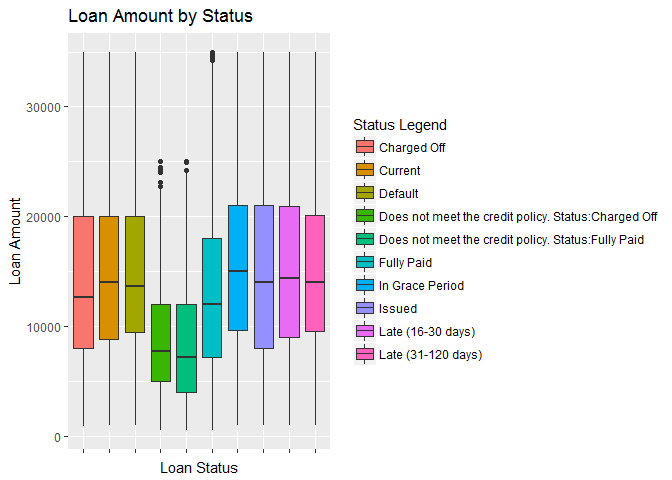
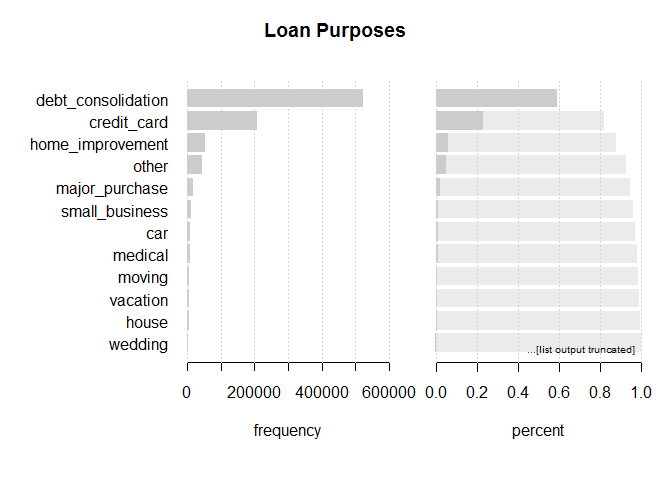
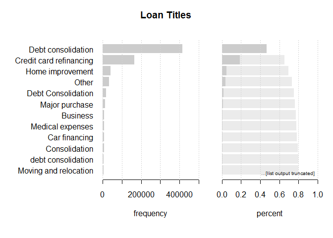
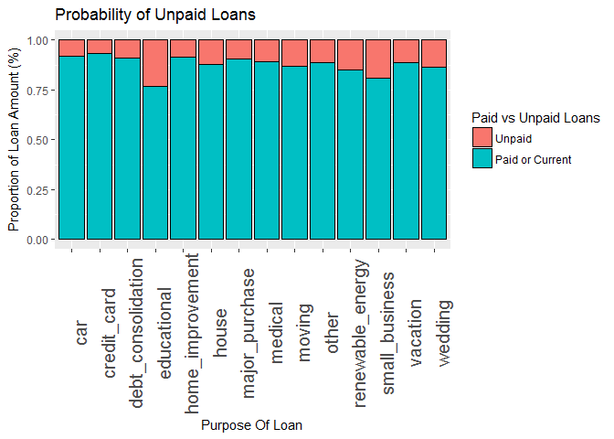

Adyen Loan Test
================
Brandon Wong
23 January 2017

R Markdown file for Technical Test
----------------------------------

This is the final code for my technical test. There are 7 questions in total.

Libraries needed + Setup
------------------------

``` r
options(max.print=999999) # Increase limit for max.print, 800k+ rows were omitted. Then read CSV "loan.csv" file (stored locally in this case)
options(scipen=999) # Remove scientific notation, where ### is the switch point
Original_Loan_File <- read.csv("C://Users//Brandon Wong//Documents//Adyen_Test//wetransfer-937f2c//data-analysis-test//loan.csv", header = TRUE, sep = ",")

library(DescTools)
library(ggplot2)
```

    ## Warning: package 'ggplot2' was built under R version 3.3.2

``` r
library(dplyr)
```

    ## 
    ## Attaching package: 'dplyr'

    ## The following objects are masked from 'package:stats':
    ## 
    ##     filter, lag

    ## The following objects are masked from 'package:base':
    ## 
    ##     intersect, setdiff, setequal, union

Questions:
----------

### Question 1: Provide a distribution of loans

#### Using DescTools package, one can view the 1. Density graph, 2. Box and Whisker plot, 3. Empirical CDF plot

``` r
Desc(Original_Loan_File$loan_amnt, plotit = TRUE, main = "Applied Loan Amount")
```

    ## ------------------------------------------------------------------------- 
    ## Applied Loan Amount
    ## 
    ##     length         n       NAs    unique        0s      mean    meanSE
    ##    887'379   887'379         0     1'372         0  14755.26      8.95
    ## 
    ##        .05       .10       .25    median       .75       .90       .95
    ##    3600.00   5000.00   8000.00  13000.00  20000.00  28000.00  32000.00
    ## 
    ##      range        sd     vcoef       mad       IQR      skew      kurt
    ##   34500.00   8435.46      0.57   8599.08  12000.00      0.68     -0.26
    ##  
    ## lowest : 500.0 (11), 550.0, 600.0 (6), 700.0 (3), 725.0
    ## highest: 34900.0 (14), 34925.0 (9), 34950.0 (18), 34975.0 (31), 35000.0 (36'368)



### Question 2: What is the lowest loan amount?

``` r
min(Original_Loan_File$loan_amnt, na.rm = TRUE) # Note: This can also be seen from Qn 1 result
```

    ## [1] 500

### Question 3: What is the highest loan amount?

``` r
max(Original_Loan_File$loan_amnt, na.rm = TRUE) # Note: This can also be seen from Qn 1 result
```

    ## [1] 35000

### Question 4: Provide a graph that visualizes the issued loans over time

#### This is a graph of Loan Amounts over time

``` r
Original_Loan_File$issue_d <- as.Date(gsub("^", "01-", Original_Loan_File$issue_d), format="%d-%b-%Y") # Format date

OverTime_df1 <- Original_Loan_File %>% 
  select(issue_d, loan_amnt) %>% 
  group_by(issue_d) %>% 
  summarise(Sum_Of_Amount = sum(loan_amnt))

#Plotting chart
issuedovertime_chart <- ggplot(OverTime_df1, 
                  aes(x = issue_d, y = Sum_Of_Amount))
issuedovertime_chart + geom_line() + ggtitle("Issued Loans Over Time") + labs(x = "Loan Date Issued", y = "Loan Amount")
```



#### This is a more detailed graph of Loan Amounts over time (by Grade)

``` r
OverTime_df2 <- Original_Loan_File %>% 
  select(issue_d, loan_amnt, grade) %>% 
  group_by(issue_d, grade) %>% 
  summarise(Sum_Of_Amount = sum(loan_amnt))

# Plotting chart
issuedovertimegrades_chart <- ggplot(OverTime_df2, aes(x = issue_d, y = Sum_Of_Amount))
issuedovertimegrades_chart + geom_area(aes(fill=grade)) + ggtitle("Issued Loans Over Time by Grade") + labs(x = "Date Issued", y = "Loan Amount") + scale_fill_discrete(name="Grades (A-G)")
```



### Question 5: Provide a graph that visualizes the loan status

``` r
Desc(Original_Loan_File$loan_status, main = "Loan Status", plotit = T)
```

    ## ------------------------------------------------------------------------- 
    ## Loan Status
    ## 
    ##    length       n     NAs  unique  levels   dupes
    ##   887'379 887'379       0      10      10       y
    ## 
    ##                                                   level     freq   perc  cumfreq  cumperc
    ## 1                                               Current  601'779  67.8%  601'779    67.8%
    ## 2                                            Fully Paid  207'723  23.4%  809'502    91.2%
    ## 3                                           Charged Off   45'248   5.1%  854'750    96.3%
    ## 4                                    Late (31-120 days)   11'591   1.3%  866'341    97.6%
    ## 5                                                Issued    8'460   1.0%  874'801    98.6%
    ## 6                                       In Grace Period    6'253   0.7%  881'054    99.3%
    ## 7                                     Late (16-30 days)    2'357   0.3%  883'411    99.6%
    ## 8    Does not meet the credit policy. Status:Fully Paid    1'988   0.2%  885'399    99.8%
    ## 9                                               Default    1'219   0.1%  886'618    99.9%
    ## 10  Does not meet the credit policy. Status:Charged Off      761   0.1%  887'379   100.0%



``` r
# This graph shows the distribution of loan amounts by status
LoanAmnt_by_Status_chart <- ggplot(Original_Loan_File, aes(loan_status, loan_amnt))
LoanAmnt_by_Status_chart + geom_boxplot(aes(fill = loan_status)) +
  theme(axis.text.x = element_blank()) +
  ggtitle("Loan Amount by Status") +
  labs(list(x = "Loan Status", y = "Loan Amount")) +
  scale_fill_discrete(name="Status Legend")
```



### Question 6: Provide a graph that visualizes the reason people took out a loan in percentages

``` r
Desc(Original_Loan_File$purpose, main = "Loan Purposes", plotit = TRUE)
```

    ## ------------------------------------------------------------------------- 
    ## Loan Purposes
    ## 
    ##    length       n     NAs  unique  levels   dupes
    ##   887'379 887'379       0      14      14       y
    ## 
    ##                  level     freq   perc  cumfreq  cumperc
    ## 1   debt_consolidation  524'215  59.1%  524'215    59.1%
    ## 2          credit_card  206'182  23.2%  730'397    82.3%
    ## 3     home_improvement   51'829   5.8%  782'226    88.2%
    ## 4                other   42'894   4.8%  825'120    93.0%
    ## 5       major_purchase   17'277   1.9%  842'397    94.9%
    ## 6       small_business   10'377   1.2%  852'774    96.1%
    ## 7                  car    8'863   1.0%  861'637    97.1%
    ## 8              medical    8'540   1.0%  870'177    98.1%
    ## 9               moving    5'414   0.6%  875'591    98.7%
    ## 10            vacation    4'736   0.5%  880'327    99.2%
    ## 11               house    3'707   0.4%  884'034    99.6%
    ## 12             wedding    2'347   0.3%  886'381    99.9%
    ## ... etc.
    ##  [list output truncated]



``` r
Desc(Original_Loan_File$title, main = "Loan Titles", plotit = TRUE)
```

    ## ------------------------------------------------------------------------- 
    ## Loan Titles
    ## 
    ##    length       n     NAs  unique  levels   dupes
    ##   887'379 887'379       0  63'146  63'146       y
    ## 
    ##                       level     freq   perc  cumfreq  cumperc
    ## 1        Debt consolidation  414'001  46.7%  414'001    46.7%
    ## 2   Credit card refinancing  164'331  18.5%  578'332    65.2%
    ## 3          Home improvement   40'112   4.5%  618'444    69.7%
    ## 4                     Other   31'892   3.6%  650'336    73.3%
    ## 5        Debt Consolidation   15'760   1.8%  666'096    75.1%
    ## 6            Major purchase   12'051   1.4%  678'147    76.4%
    ## 7                  Business    6'728   0.8%  684'875    77.2%
    ## 8          Medical expenses    6'674   0.8%  691'549    77.9%
    ## 9             Car financing    5'565   0.6%  697'114    78.6%
    ## 10            Consolidation    5'381   0.6%  702'495    79.2%
    ## 11       debt consolidation    4'834   0.5%  707'329    79.7%
    ## 12    Moving and relocation    3'921   0.4%  711'250    80.2%
    ## ... etc.
    ##  [list output truncated]



### Question 7: Show other interesting insights

#### The previous question caught my eye, where column "purpose" indicated why people took loans. As such, I sought to find out what the probability of unpaid loans was among the different loan purposes.

``` r
Original_Loan_File$PaidVsUnpaid <- "Unpaid" # creating a new column and filling
Original_Loan_File$PaidVsUnpaid[which(Original_Loan_File$loan_status == "Fully Paid"
                                      |Original_Loan_File$loan_status == "Current"
                                      |Original_Loan_File$loan_status == "Does not meet the credit policy. Status:Fully Paid") ] <- "Paid or Current"

Original_Loan_File$PaidVsUnpaid <- factor(Original_Loan_File$PaidVsUnpaid)
Original_Loan_File$PaidVsUnpaid <- factor(Original_Loan_File$PaidVsUnpaid, levels = rev(levels(Original_Loan_File$PaidVsUnpaid)))
table(Original_Loan_File$PaidVsUnpaid) # Output of no. of Paid Loans vs Unpaid Loans
```

    ## 
    ##          Unpaid Paid or Current 
    ##           75889          811490

#### Now that the new variables are created, we can go ahead with the plotting of the chart

``` r
Purpose_Of_Loan <- aggregate(loan_amnt ~ purpose + PaidVsUnpaid, 
                             data = Original_Loan_File, sum)

# This is the Probability of Unpaid Loans chart
ggplot(Purpose_Of_Loan, aes(x = purpose, y = loan_amnt, fill = PaidVsUnpaid)) + 
  ggtitle("Probability of Unpaid Loans") + 
  labs(x = "Purpose Of Loan", y = "Proportion of Loan Amount (%)") + 
  scale_fill_discrete(name="Paid vs Unpaid Loans") + 
  geom_bar(position = "fill", stat = "identity", colour = "black") + 
  theme(axis.text.x=element_text(size=15, angle = 90))
```



### This graph would go to show that educational loans are rather high risk, where almost a quarter (25%) of them are unpaid. Thus, the stakeholder might find it wise to limit the instances of educational loans.
